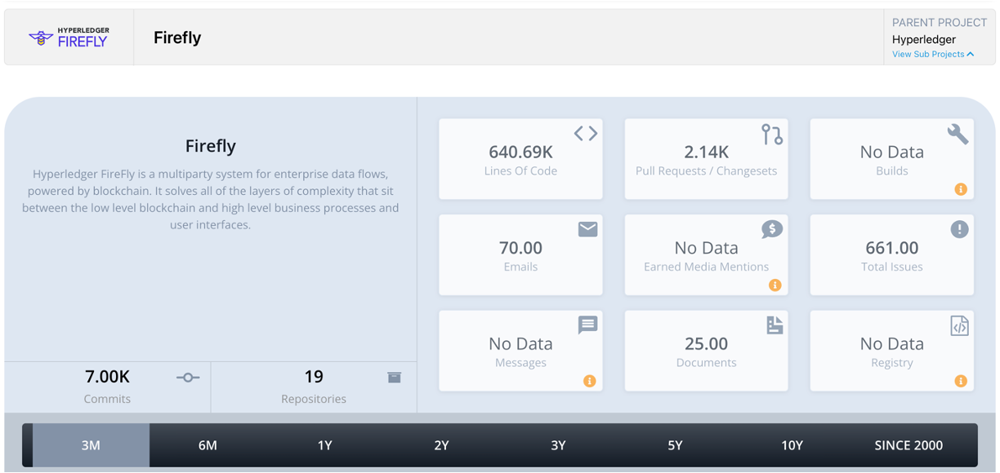
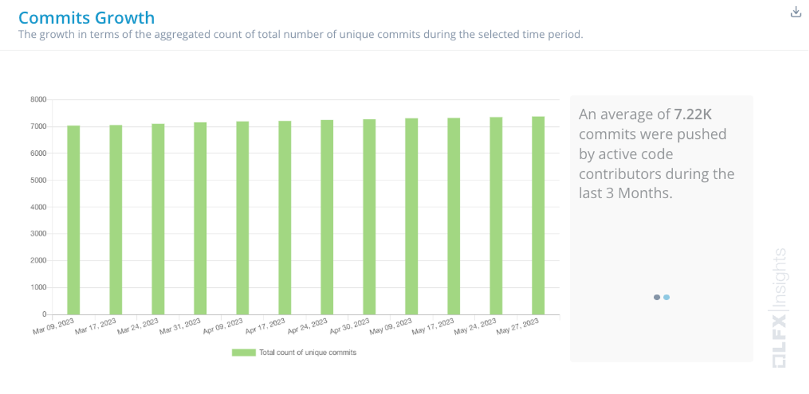
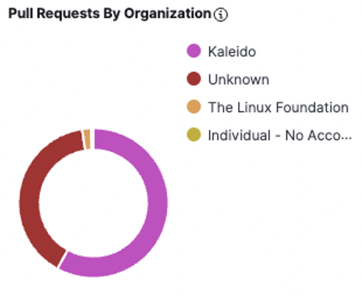

# Project Health

Hyperledger FireFly has seen very strong activity over the past year and this has continued to gain even more momentum this quarter. It has powered many use cases in the community,  with examples that include SWIFT, CGI Federal, and LACChain.

### Community adoption updates

- Swift completed successful testing of cross-border CBDC payments on a [CBDC sandbox leveraging Hyperledger FireFly](https://www.swift.com/news-events/news/successful-testing-paves-way-cbdc-use-cross-border) with 18 central and commercial banks, including the Banque de France, the Deutsche Bundesbank, the Monetary Authority of Singapore, BNP Paribas, HSBC, Intesa Sanpaolo, NatWest, the Royal Bank of Canada, SMBC, Société Générale, Standard Chartered, and UBS.

- [CGI Federal](https://www.youtube.com/watch?v=jLoOW0g5WdE) spoke about digital transformation in government at Consensus 2023 and how FireFly has helped them break down data silos and enable collaboration in real-time for government agencies. Example projects include bringing auditability to the Department of Defense supply chain, tokenization of the space economy, securing metaverse assets, sharing healthcare data with zero trust, and enabling transparency and accountability in AI.

- LACChain is a blockchain infrastructure project designed for enabling inclusive and scalable projects and solutions on web 3.0 for Latin American and the Caribbean. FireFly is a key component of their tech stack and they have written up a [tutorial](https://lacnet.lacchain.net/firefly/) for deploying FireFly onto LACChain.

### Community members have given talks featuring Hyperledger FireFly at a number of events including

- Hyperledger Meetup: [The future of Web3](https://www.youtube.com/watch?v=gvUQmPXHS0Y), featuring speakers from Fidelity, IBM, and Duke University.

- Hyperledger Workshop: [Using Hyperledger FireFly to Launch an NFT Collection on Public Chains](https://www.youtube.com/watch?v=OMI-xuysiwI)

- Consensus 2023: [The CBDC Tech Stack: How One Ethereum Firm is Working with Central Banks](https://consensus.coindesk.com/agenda/event/-how-to-make-cross-chain-bridges-hack-proof-8)

- BuildEth: Build Ethereum dApps Quicker than Ever with Hyperledger FireFly

- Blockchain Expo: From Web2 to Web3: How Enterprises are Adopting Blockchain, Digital Assets and NFTs

### Contributor activity updates

The Discord community continues to be very active with 86 members participating in discussions this quarter. Additionally, we’ve seen an increase in non-maintainer engagement, with community members conversing and answering each other’s questions.

In the community, builders have been working on various extensions for FireFly for public blockchain communities such as Tezos.

Contributors are active in the project and since March, commits by new contributors have increased by 100%.

There are currently 715k lines of code for Hyperledger FireFly across 19 repositories, with a total of 7.4k commits to date.

FireFly has had significant performance and experience updates allowing for much more flexible configurations with the release of FireFly 1.2. Details may be found in the “Releases” section that follows below.

# Questions/Issues for the TSC

There are no issues at this time.

# Releases

[FireFly 1.2.0](https://github.com/hyperledger/firefly/releases/tag/v1.2.0)

__EVMConnect Maturity__: EVMConnect was introduced last year as a new generation of blockchain connector for Hyperledger FireFly and is the key enabler for using FireFly with Ethereum based blockchains, whether they are public, permissionless chains or private, permissioned chains. Since its initial release new features have been continually added, while performance and reliability have increased. As of FireFly v1.2.0, EVMConnect is now the recommended blockchain connector of choice for Ethereum based chains, and is now the default option when creating a FireFly stack with the FireFly CLI. Support and bug fixes will continue for ETHConnect, as there are many existing production deployments of it today.

__OpenZepplin Wizard Support__: FireFly's token APIs now work with a much wider variety of ERC-20, ERC-721, and ERC-1155 contracts, supporting variations of these contracts generated by the [OpenZepplin Contract Wizard](https://docs.openzeppelin.com/contracts/4.x/wizard).

__Operational Improvements__: Request ID tracking through FireFly microservices, along with support for passing custom HTTP headers allow increased traceability and better operational efficiency. Additionally, richer error reporting now supports custom smart contract error messages passed all the way back to FireFly’s API, making troubleshooting easier.

FireFly can also now automatically detect changes to its config file and dynamically add or remove namespaces and plugins, allowing for zero-downtime configuration changes.

__Compliance and Controls__: Enterprises need complete control over their data and data retention policies. New FireFly APIs give them that control by allowing them to delete data records from their system, enabling them to meet the strict retention requirements of certain industries.

[FireFly 1.1.4](https://github.com/hyperledger/firefly/releases/tag/v1.1.4)

FireFly v1.1.4 is a patch release and contains many recent bug fixes that have been backported to the v1.1.x release train. It is recommended to upgrade existing FireFly v1.1.x deployments to this release.

The full list of releases can be found at: [https://github.com/hyperledger/firefly/releases](https://github.com/hyperledger/firefly/releases)

# Overall Activity in the Past Quarter

The Discord is very active and project maintainers answer questions regularly. Some metrics for the last 90 days of activity.

PR Activities:

<https://insights.lfx.linuxfoundation.org/projects/hyperledger%2Ffirefly/dashboard;subTab=technical;v=pull-request-management%2Fgithub-pr%2Foverview>

Contributor Strength:

<https://insights.lfx.linuxfoundation.org/projects/hyperledger%2Ffirefly/dashboard;quicktime=time_filter_3M>

Commit Activities:

<https://insights.lfx.linuxfoundation.org/projects/hyperledger%2Ffirefly/dashboard;subTab=technical;v=source-control%2Fcommits%2Foverview>

# Current Plans

__FireFly v1.3.0__
The next feature release of FireFly is currently in active development and will include many new exciting features:

- Significantly enhanced onchain / offchain data coordination including the ability to attach a FireFly message to a custom contract invocation
- Additional APIs for deleting FireFly Resources such as Token Pools, Contract Interfaces etc.
- Configurable mTLS security across FireFly microservices for internal service-to-service authentication and encryption
- PostgreSQL support for EVMConnect persistence
- ERC-1155 token connector improvements for supporting a wider variety of ERC-1155 contracts
- Performance improvements in transaction throughput and latency

An additional, significant architectural roadmap item is active-active HA for FF FireFly Core. This will offer scaling improvements, increased resiliency, and more flexible deployment and migration options. This work is currently in the design phase and the related work is being tracked in GitHub.

# Maintainer Diversity

No new maintainers in this quarter.

# Contributor Diversity

In the past quarter we’ve seen an increase in contributor strength, commit growth, and new contributors from parties outside of Kaleido.

